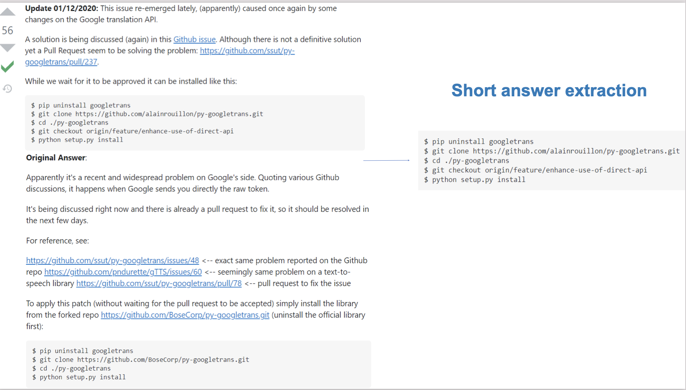
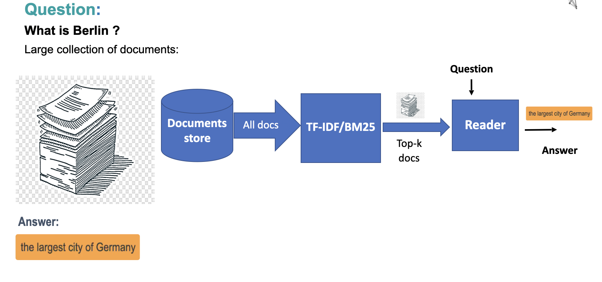
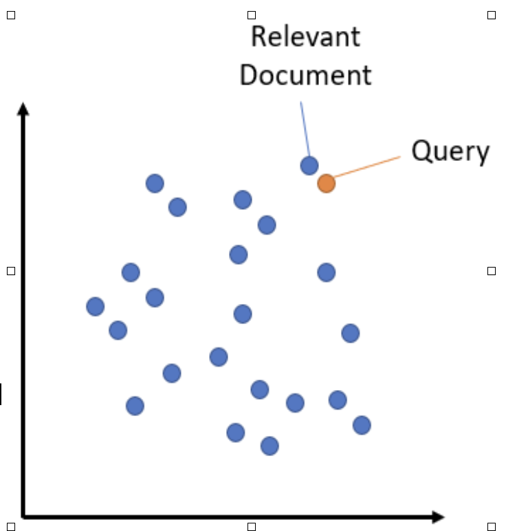
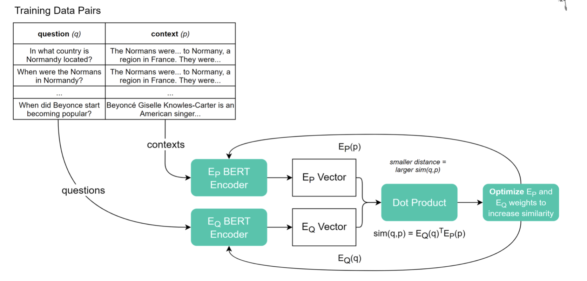
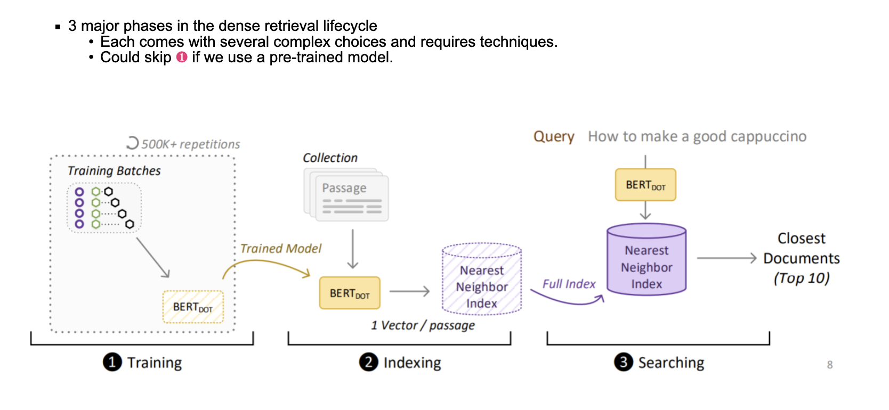
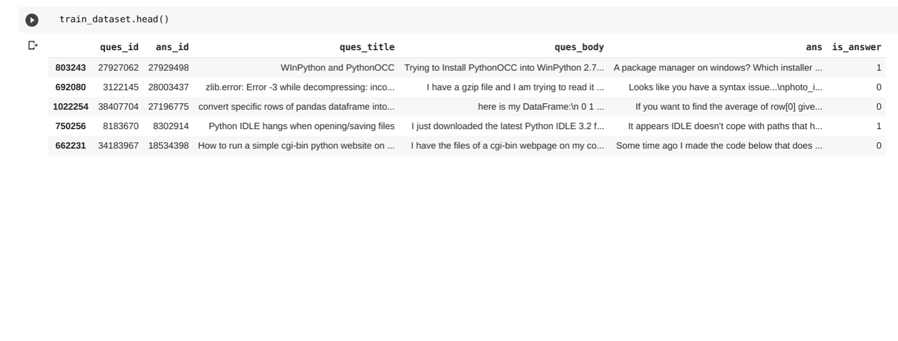
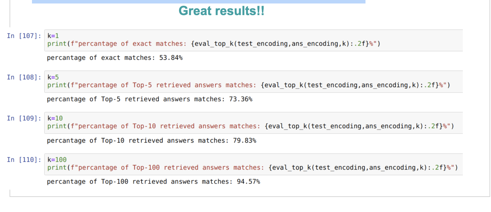

# Python Question Answering System
## Problem
Programmers all over the world face a lot of issues while their everyday coding
session, they waste a lot of time trying to find the best solutions and solve this
issue maybe more than the time of coding.

We implement a question answering system to help them find a solution for their
problems easily by entering a question to the system and the result will be a long
answer and a short answer.

The short answer is the code solving this problem as most of the programmers are
seeking for the code without any details.
while the long answer will be the code and the text describing the code and the
solution.

Our system is using semantic search to find solutions related to the meaning of the
question, so it is not searching only for solutions have the exact keywords of the
question as its one of modern search techniques.

### Short answer extraction

A question answering system will help you find information efficiently. Generally speaking, we use search engines to search for relevant documents when we look for some information on the Web. However, because they show you documents, you must read the documents and decide whether they contain the information you need. It’s a bother. Thus, commercial search engines have a question answering feature so that you can find information efficiently.

### Conventional search vs Modern search

### Search by syntax

### Search by semantic

## Dataset

Our data is about Question and Answer in Python from StackOverflow from year 2008 – 2016 form Kaggle which collected by using Stack Overflow Big Query API.

Full text of all questions and answers from Stack Overflow that are tagged with the python tag.
The dataset contains questions all questions asked between August 2, 2008 and October 19, 2016.

This dataset is organized as three tables:

1. Questions
2. Answers
3. Tags

### Questions Table
* Title: string
* Body: HTML tags string
* Creation Date: date
* Score: integers
* Id: unique integers
* Owner User Id: integers

### Answers Table
* Body: HTML tags string
* CreationDate : date
* Score: integers
* OwnerUserID: integers
* ParentId: ref integers 
* Id: unique integers

## Our Goal
Given a question and a large collection of documents.

* Provide a correct answer.
* Provide a correct short answer.

### Brute-force approach

### Retriever reader pipeline

### Types of information retrieval

| Sparse Retrieval | Dense Retrieval |
|----------|----------|
| TF-IDF / BM25  | Dense Passage Retrieval   |
| Operate by looking for shared keywords between the document and query| Embed both document and query into a shared embedding space using deep neural network|
| Simple but effective | Powerful but computationally more expensive especially during indexing |
| Don’t need to be trained | Trained using labelled datasets |

### Sparse retrievers are bottleneck for NLP systems

### Dense Retrieval (semantic search)

Dense Retrieval seeks to improve search accuracy by understanding the content of the search query.

Main Idea:
* Embed all queries and relevant documents into d-dimensional vector space.
At search time, the query is embedded into the same vector space and the closest embeddings from your corpus are found. 

### DPR Model

### Dense Retrieval Lifecycle

### Nearest Neighbour Search

* Once we have a trained DR model, we encode every passage in our collection
We save passages in an (approximate) nearest neighbour index
* During search we encode the query on the fly and search for nearest neighbour vectors in the passage index 

### Brute-Force NN Search GPU vs Approximate NN Search

#### NN Search: GPU Brute-Force
* Retrieving the top-1K from 9 million vectors is fast
   * We need to do 9M dot-products (a very big matrix multiplication) with 768 dim vectors.
* GPUs are made for this
   * Vectors must fit in GPU memory 
   * 70ms latency / query
   * Incredible scale when increasing the batch size
   * Using a CPU this takes ~1 sec. / q

#### Approximate NN Search

* Brute-force search does not scale well beyond a couple of million vectors
* Fortunately, nearest neighbor search of vectors is a very common and broadly used technique in ML
   * We have many techniques and libraries to speed up search for sub-linear results
* Popular library: FAISS
   * Offering many algorithms (brute-force, inverted lists on clusters, HNSW, …) 
   * CPU and GPU supported 
* Approximate search is another tradeoff between latency-effectiveness 

## How we applied DPR on our Dataset
* Create labeled dataset on Python Questions & Answers as shown in 2_labeled_dataset_creation notebook attached to this Repo.

* Trained and evaluated the model in 3_retrieval notebook attached to this Repo.

## Evaluate the model on the Retrieval task with test set.

